## habit-tracking-app

### Description

Habit tracking app is a Python lightweight, desktop application that compromises between minimalism and user-friendly features.

### Features

- Create, modify and delete habits
- Two periods to choose: daily and weekly
- Analytics module
- Two different appearance modes: dark and light
- Two different color themes: blue and green

## Getting started

### Project File Structure
```
habit_tracking_app:.
│   LICENSE                 # License file
│   MANIFEST.in             # Distribution manifest file
│   README.md               # Read-me file
│   setup.py                # Distribution setup file
├───habit_tracking_app      # Includes app files
│   ├───database            # Includes sql scripts (also database and config file after first initialization)
│   ├───frames              # Includes app sub frames
│   │   └───functions       # Includes functions used by app
│   ├───icons               # Includes icons images
│   └───tests               # Includes tests
└───readme_images           # Includes images used in readme         
```

### Prerequisites
 - Python : >=3.10

### Installation

You can install this project using [PyPI](https://pypi.org/project/habit-tracking-app/):
```
$ pip install habit-tracking-app
```
Then to run it, execute the following in the terminal:
```
$ habit-tracking-app
```

### Using the Application
Upon opening the application, you will be greeted by home page:

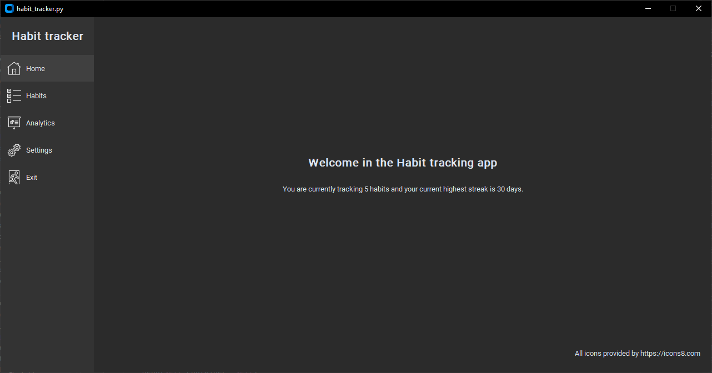

Via navigation menu on the left, you can change pages of the application. Currently opened page is highlighted.

On the habits page, you can see your currently tracked habits and access habits relevant options:

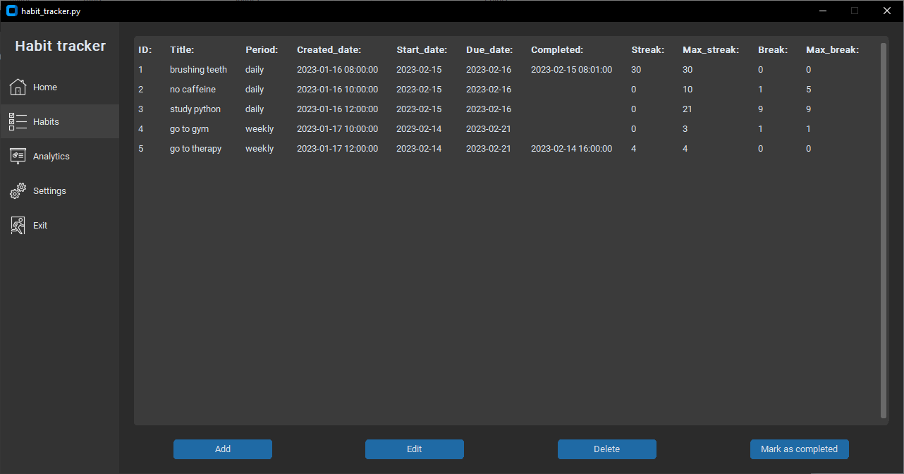

To add habit, select option "Add" and then enter title of new habit, select period, starting date and press "Submit":

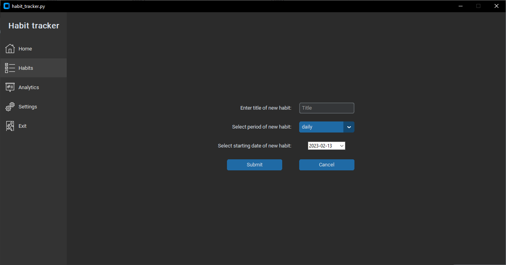

To edit habit, select option "Edit" and then select habit which you want to edit. Enter new title, period, starting date and confirm by pressing "Submit":

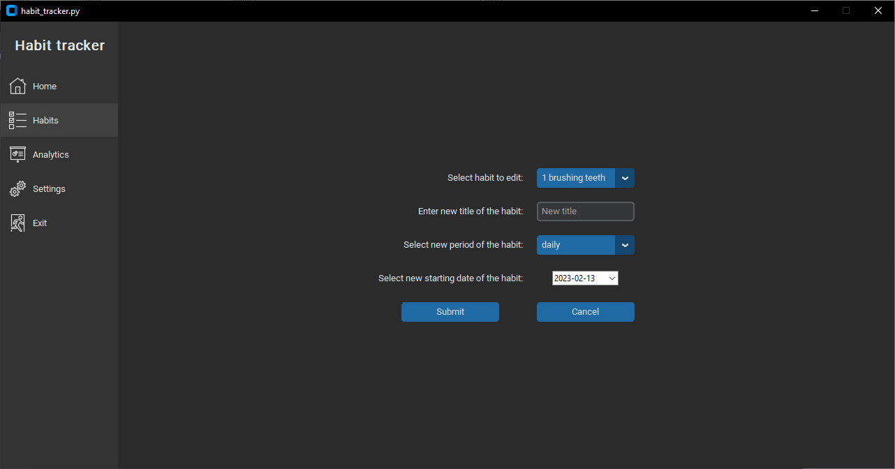

To delete habit, select option "Delete" and then select habit which you want to delete. Confirm by pressing "Remove":

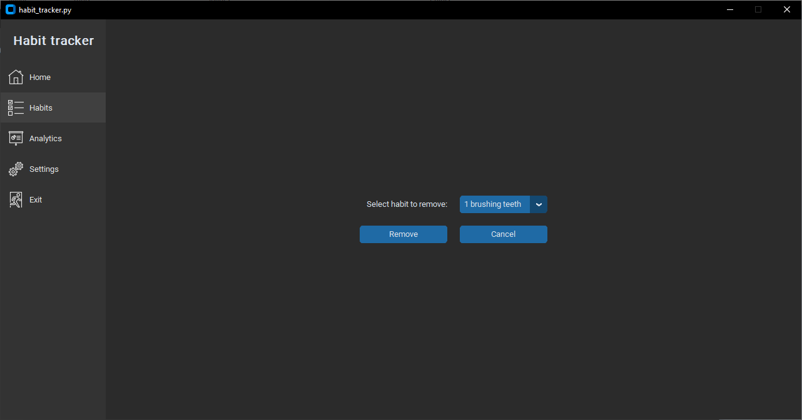

To mark habit as completed, select option "Mark as completed", and then select habit which you want to mark as completed. Confirm by pressing "Submit":

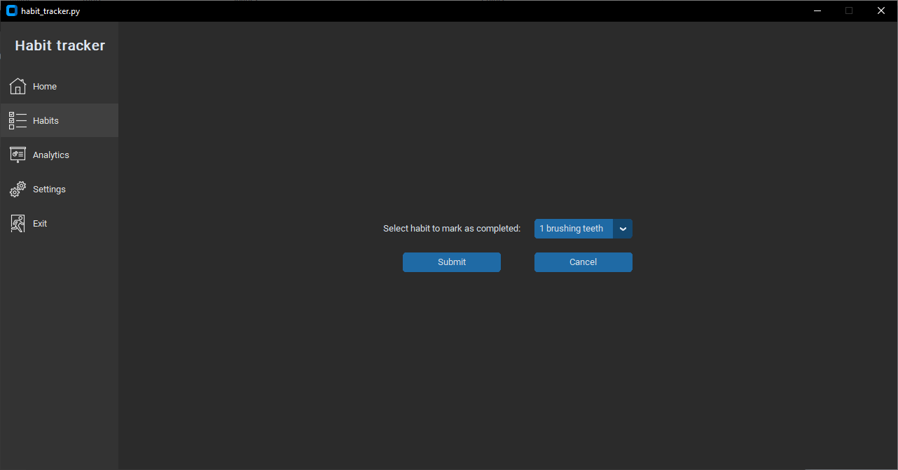

On the Analytics page, you can select between multiple general and habit specific functions to analyze your habits:

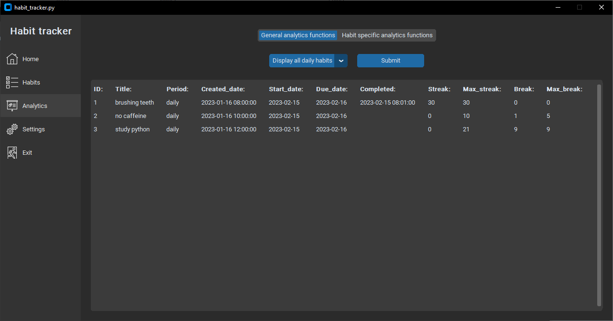

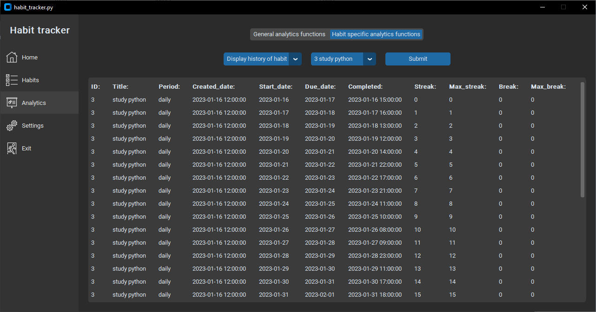

On the settings page, you can select between two appearance modes and two color themes:

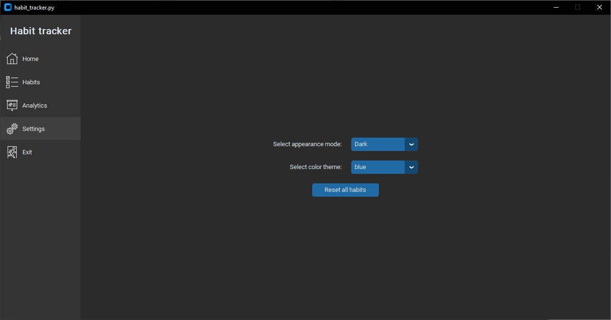

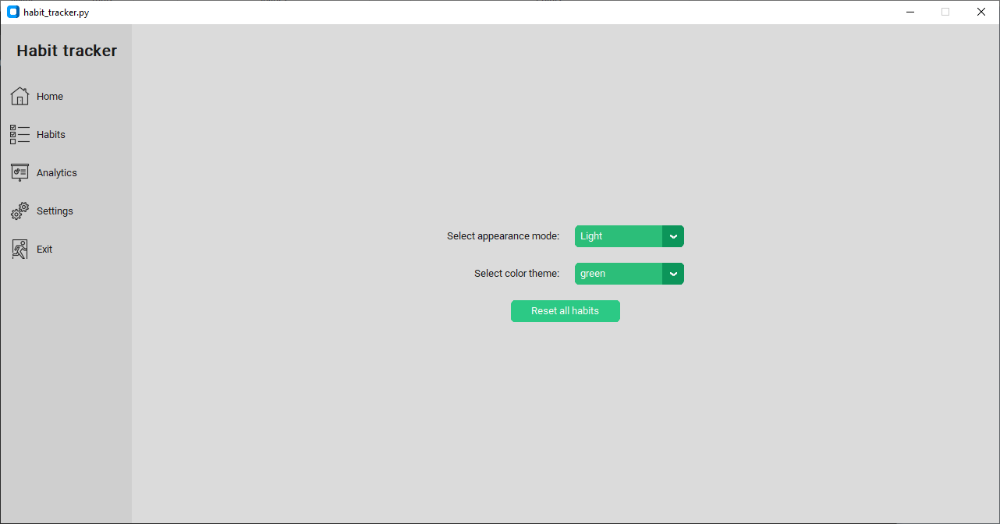

On the settings page, you can also reset all data. After pressing button, you will be required to confirm it:

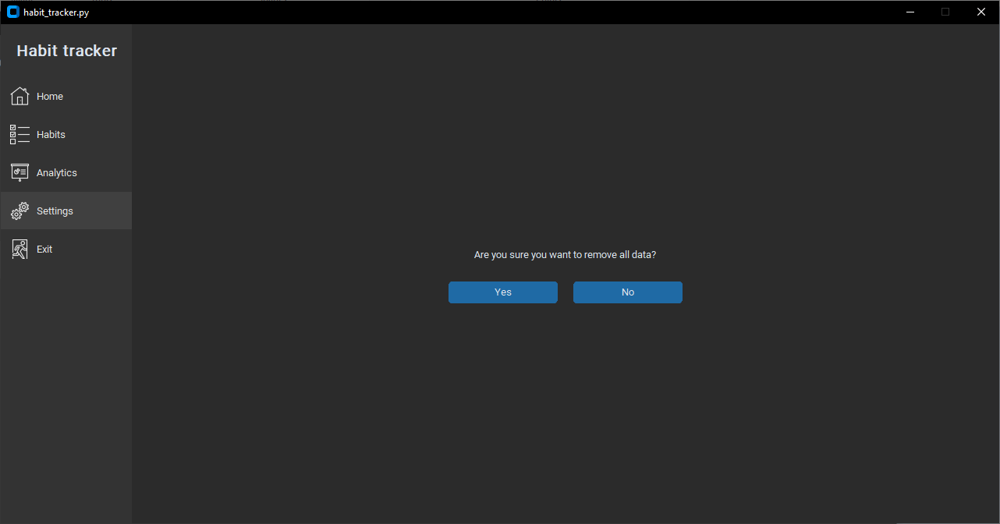

Pressing on "X" or selecting exit page will bring you to the screen asking to confirm if you want to exit:

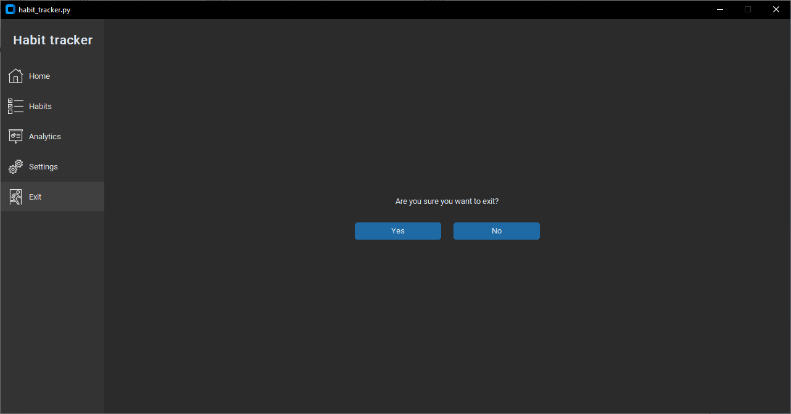

### Testing

Tests are located in habit_tracking_app/tests/ and are run using unittest:
```
$ habit-tracking-app-tests
```

### License

See the [LICENSE](LICENSE) file for license rights and limitations (The Unlicense).

### Author

I'm [Krzysztof Szczypkowski](https://www.linkedin.com/in/krzysztof-szczypkowski-1654b9192/). Email: krzysztof.szczypkowski@o2.pl
